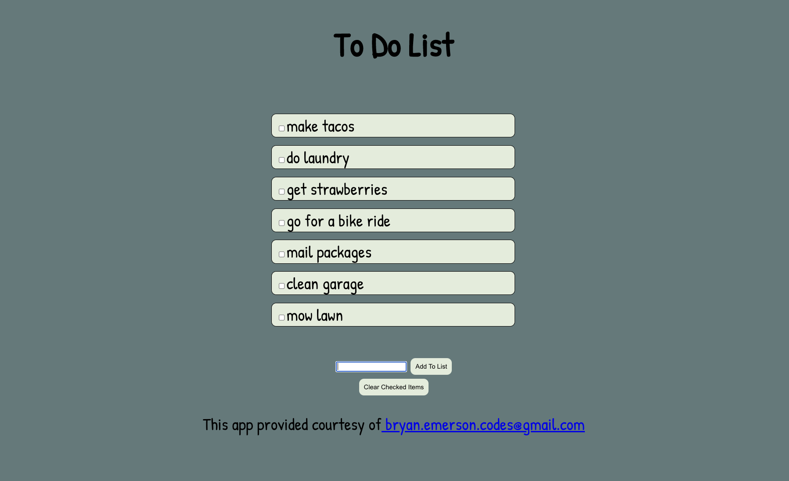

# TypeScript Shopping List!

Welcome to the best new To Do List app on the web!



## Technology Used

This app was created with HTML, CSS, and TypeScript. Typescript was chosen to prevent datatype errors from popping up in the runtime environment during development. The app was bundled with Snowpack. Snowpack is a fast, lightweight bundler that allows for module integration due to its ESM foundation. Snowpack bundles up node modules for use by the browser, and also provides live re-rendering so that development changes are reflected instantly in the browser.

A Task type, and Task array are instantiated. As tasks are added to the array with the input form/button, unique IDs are added to each item with the uuidv4 node package. The array is iterated through and \<li> items are programmatically added to the \<ul> parent node. Tasks are then written to local memory to persist. The IIFE ```loadTasks()``` then re-renders the array as \<li> items!

An event listener has been added to the ‘Clear Checked Items’ button. When clicking the button to clear checked items, the checked items are added to an array. For loops iterate through both arrays comparing the unique IDs of each item in each array. For loops were chosen because with this small amount of data they will not affect performance. If the unique IDs for two items in the two separate arrays match, then the item is spliced out of the tasks array. The array is the re-rendered and re written to local storage to persist!

## Installation

You will need the proper node packages installed to contribute to this project. Use the CLI to install the proper node packages in the directory where you have cloned the repository. The necessary dev dependencies can always be found in the package.json. The following CLI command will install dev dependencies listed in the package.json

```bash
npm install
```

To start the react app in your browser run
```npm start```

## Usage
Simply add needed items by typing the name of the item in the form. Click the 'Add To List' button to add the item to the list. If items need to be cleared from the list, simply check the box next to the item and then click the 'Clear Checked Items' button.

## Contributing
Pull requests are welcome. For major changes, please open an issue first to discuss what you would like to change.


Repo: https://github.com/bryan-emerson/toDoList-Snowpack

Deployed Site: https://soft-clock.surge.sh/

## Available Scripts

### npm start

Runs the app in the development mode.
Open http://localhost:8080 to view it in the browser.

The page will reload if you make edits.
You will also see any lint errors in the console.

### npm run build

Builds a static copy of your site to the `build/` folder.
Your app is ready to be deployed!
